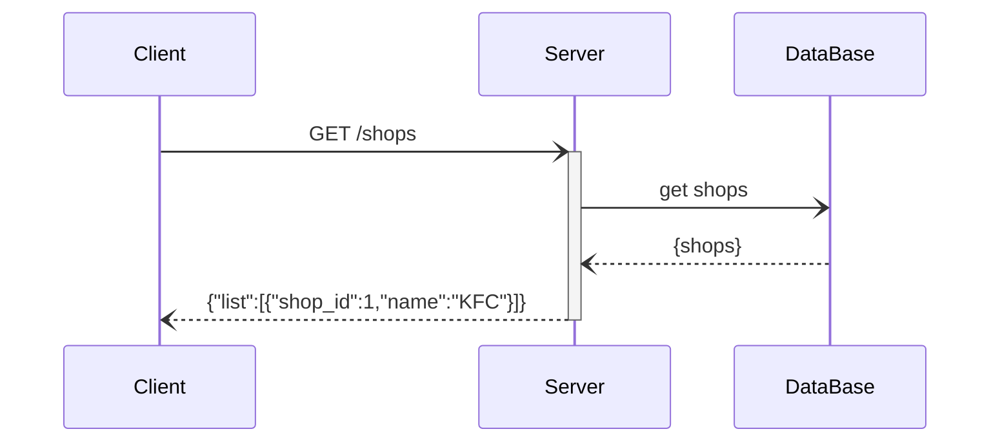
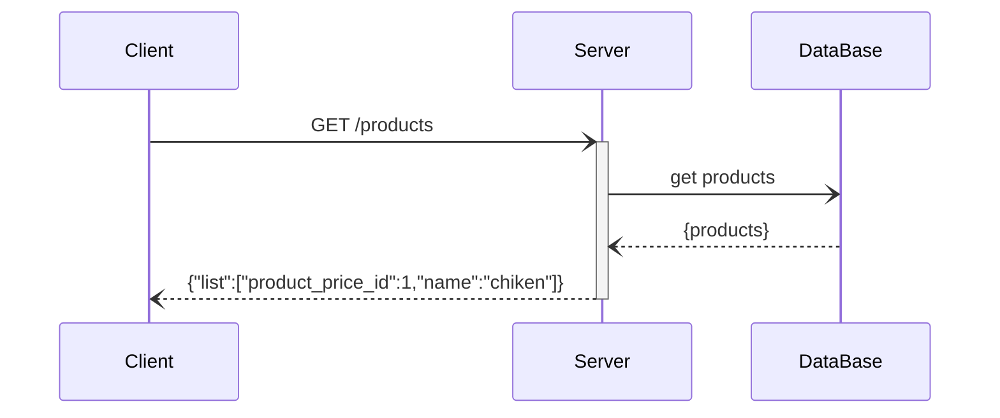
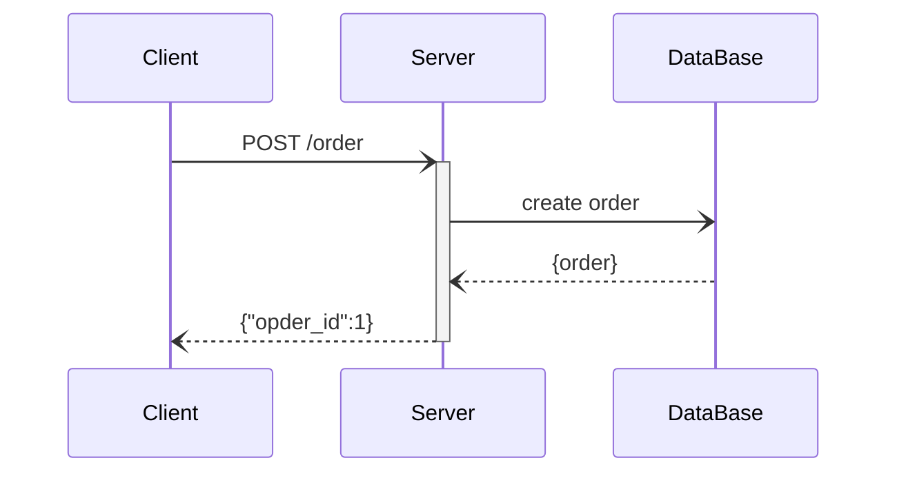
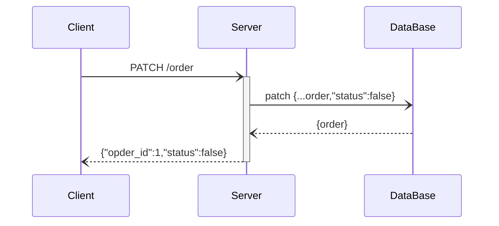
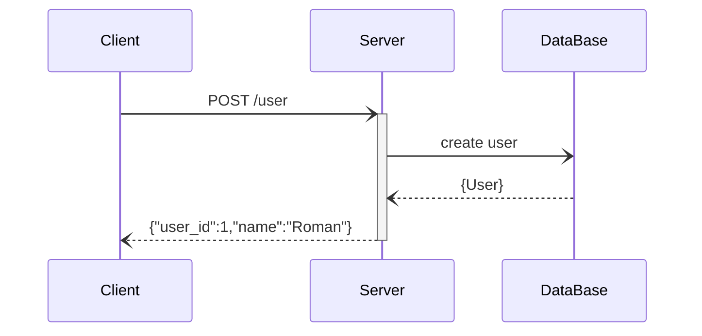

### Get shop list

```mermaid
sequenceDiagram
    participant C as Client
    participant S as Server
    participant B as DataBase

    C-)+S: GET /shops
    S-)B: get shops
    B--)S: {shops}
    S--)-C: {"list":[{"shop_id":1,"name":"KFC"}]}
```

### Get product list

```mermaid
sequenceDiagram
    participant C as Client
    participant S as Server
    participant B as DataBase

    C-)+S: GET /products
    S-)B: get products
    B--)S: {products}
    S--)-C: {"list":["product_price_id":1,"name":"chiken"]}
```

### Create order

```mermaid
sequenceDiagram
    participant C as Client
    participant S as Server
    participant B as DataBase

    C-)+S: POST /order
    S-)B: create order
    B--)S: {order}
    S--)-C: {"opder_id":1}
```

### Cancel order

```mermaid
sequenceDiagram
    participant C as Client
    participant S as Server
    participant B as DataBase

    C-)+S: PATCH /order
    S-)B: patch {...order,"status":false}
    B--)S: {order}
    S--)-C: {"opder_id":1,"status":false}
```

### Create user

```mermaid
sequenceDiagram
    participant C as Client
    participant S as Server
    participant B as DataBase

    C-)+S: POST /user
    S-)B: create user
    B--)S: {User}
    S--)-C: {"user_id":1,"name":"Roman"}
```
